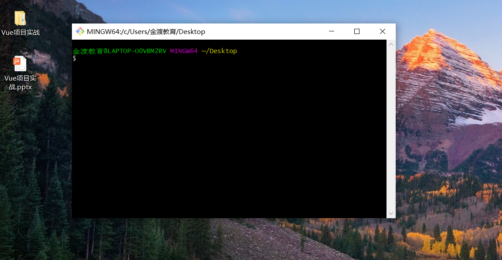

# Git
## Git简介
Git是目前最流行和最先进的分布式版本控制系统。

cvs和SVN（用的最多）是集中式的版本控制系统，速度慢，必须要联网使用。

## Git安装
官网地址：[https://git-scm.com/]


下载自己需要的系统版本，安装之后在桌面点击鼠标右键就能看到下图所示：


点击Git Bash Here就会看到蹦出一个类似命令行窗口的东西，就说明Git安装成功！


## Git使用
如果是使用Windows系统，为了避免遇到各种莫名其妙的问题，尽量确保目录名（包括父目录）不包含中文。

1、新建一个demo文件夹,在文件中打开Git Bash,输入git init,就可以把git仓库建好了，并且会告诉我们是一个空仓库。demo文件夹里会多一个.git目录，如果没有看到这个目录，可以点击文件夹上面的查看中的隐藏的项目，或者git命令行中输入ls -ah命令就可以看见了。

**所有的版本控制系统，都只能跟踪文本文件的改动，对于图片和视频只能知道发生了改变但是具体改变了哪里是检测不到的**

2、在demo文件夹里面新建一个test.txt文件,然后添加到仓库
```git
git add test.txt
```
执行完这行命令没有任何显示就对了，Unix的哲学是“没有消息就是好消息”，说明我们添加文件到仓库成功了。

3、把文件提交到git仓库
```git
git commit -m 'This is jianan first commit'
```
到这里的时候会提示我们添加对应的邮箱信息和用户名

以上就是我们初始化一个git仓库的主要步骤：
```
1、git init 初始化仓库
2、git add <file> 添加文件，可添加多个反复使用
3、git commit -m <message> 完成
```
这个时候：
- 如果我们去修改了文件的内容，可以使用git status查看当前仓库的状态。

 

- 如果自己不记得上次是怎么修改的就使用git diff这个命令查看

```git
git diff test.txt
```
- 如果想要知道自己在git仓库中的操作日志，可以使用git log命令展示（回退的时候用到了提交的ID）,如果觉得展示的信息太多，可以使用git log --pretty=oneline

- 如果想要知道文件的内容的修改就使用 git show 命令

- 如果想要知道文件的内容就使用cat test.txt命令

- 如果不需要某个文件了，就需要进行删除，使用git rm test.txt命令

以上是在本地的git仓库的常用操作，下面我们来一起学习下怎么把本地仓库的内容推送到远程仓库中。
```git
git remote add origin 仓库地址
```
```git
git branch -M main
```
```git
git push -u origin main
```

但是在我们推送之前，为了避免一些不必要的错误和麻烦。我们最好配置一下验证信息，毕竟我们的本地Git仓库和github仓库之间是通过SSH加密的。
```git
ssh-keygen -t rsa -C 'youremail@example.com'
```
上面的youremail@example.com需要输入我们注册github账号时使用的邮箱,输入完命令后会要求确认路径和输入密码，我们直接使用默认的一路回车就行了。

成功之后会生成.ssh文件夹,进去打开id_rsa.pub,复制里面的key,然后进入github上，进入Account => Settings（账户配置）


添加之后使用以下命令验证是否成功


如果要把远程仓库的内容克隆/拉取到本地，那么使用以下命令：
```git
git clone 仓库地址
```
## Git进阶
### 操作分支
1、创建分支使用git branch name命令,切换分支使用git checkout name命令。
```git
git branch one
git checkout one
```
以上命令可简写为：
```git
git checkout -b one
```
2、查看当前分支使用git branch name命令,当前的分支前面会有一个*号
```git
git branch
```
3、合并分支使用git merge name命令。
把one分支的工作成果合并到master上：
```git
git merge one
```
4、删除分支使用git branch -d name
one分支合并完成后就可以把分支删除掉了:
```git
git branch -d one
```
5、删除远程分支使用git push origin --delete name

在哪个分支里做的操作，就提交到哪个分支里去。每个分支的内容是独立的。

这里要注意的是，新版的git提供了新的git switch命令来切换分支
直接切换到现有的分支使用 git switch master
创建并且切换到新的分支使用 git switch -c two
### SourceTree
官网地址：[https://www.sourcetreeapp.com/]
SourceTree是一款免费的Git图形化管理工具，可以操作任何Git库，对于不喜欢使用git命令进行操作的，学习SourceTree是相当有必要的。
### Gitte
官网地址：[https://gitee.com/]
Gitee是一个提供免费的Git仓库,又称码云。