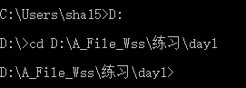

# 黑马课程笔记
```
配套资源和代码在"KnowledgeBase"仓库的 “00-Nodejs-Vue2-Vue3（黑马课程）” 文件夹中
```
## 1.初识Node.js
### 1.1回顾与思考
#### 1.浏览器中javascript的组成部分
js核心语法：变量 ，数据类型，循环，分支，判断，函数，作用域，this etc...

WebAPI:DOM操作，BOM操作，基于XMLHttpRequest的Ajax操作 etc...

#### 2.思考：为什么JavaScript可以在浏览器中比执行？
答：浏览器中有javascript解析引擎，专门负责解析和执行javascript代码
```
Chrome浏览器 => V8
Firefox浏览器 => OdinMonkey(奥丁猴)
Safri浏览器 => JSCore
IE浏览器 => Chakra(查克拉)
etc...
```
其中，Chrome浏览器的V8解析引擎性能最好！

#### 3.思考：为什么JavaScript可以操作DOM和BOM？
答：每个浏览器都内置了DOM、BOM这样的API函数，因此，浏览器中的JavaScript才可以调用它们。

#### 4.浏览器中的JavaScript运行环境
**运行环境**是指代码正常运行所需的必要环境。


<!--  -->

#### 5.思考：javascript能否做后端开发
java python php

使用javascript也可以做后端开发，只不过需要借助一个node.js。一门编程语言编写好之后，需要在运行环境中执行。如果把js代码跑在浏览器里边，浏览器本身就是一个运行环境，所以javascript可以跑在浏览器里做前端开发。 如果把js代码运行在node中，这里node也是一个运行环境，是一个后端的运行环境，这样通过node就可以用javascript做后端开发。

### 1.2Node.js简介
#### 1.什么是Node.js
```
Node.js is a JavaScript runtime built on Chrome's V8 JavaScript engine.

Node.js是一个基于Chrome V8 引擎的Javascript运行环境
```
Node.js的官方网址：[https://nodejs/org/zh-cn](https://nodejs/org/zh-cn)

在众多的浏览器中，Chrome V8引擎解析执行js代码性能最好。

#### 2.Node.js中的JavaScript运行环境
分为两个部分：V8引擎和内置API

V8引擎负责解析执行js代码；内置API提供了一些能力，让我们在js中调用node为我们提供的这些内置API去做一些后端的事情。


学习node.js一个很重要的部分就是学习这些内置的API如何使用。

注意：
- 浏览器是JavaScript的前端运行环境。
- Node.js是JavaScript的后端运行环境。
- Node.js中无法调用DOM和BOM等浏览器内置API。因为node里没有内置这些API函数

#### 3.Node.js可以做什么
Node.js作为一个JavaScript的运行环境，仅仅提供了基础的功能和API。然而，基于Nodejs提供的这些基础功能，很多强大的工具和框架如雨后春笋，层出不穷。所以学会了Nodejs，可以让前端程序员胜任更多的工作和岗位:

①：基于Express框架([http://www.expressjs.com.cn/](http://www.expressjs.com.cn/)),可以快速构建Web应用

②：基于Electron框架([https://electronjs.org/](https://electronjs.org/)) ，可以构建跨平台的桌面应用

③：基于restify框架([http://restify.com](http://restify.com)) ，可以快速构建API接口项目

④：读写和操作数据库、创建实用的命令行工具辅助前端开发、etc...

总之，Node.js是大前端时代的“大宝剑”，有了Node.js这个超级buff的加持，前端程序员的行业竞争力会越来越强！

#### 4.Node.js好学吗
好学！

会javascript，就能学会Node.js！！！

#### 5.Node.js怎么学
```
浏览器中的JavaScript学习路径:
JavaScript基础语法 + 浏览器内置API (DOM + BOM) + 第三方库jQuery, art-template 等)

Node.js的学习路径:
JavaScript基础语法 + Nodejs内置API模块(fs, path, http等) + 第三方API模块(express，mysql 等)
```
重点学习Nodejs内置API和第三方API模块


### 1.3Node.js环境的安装
如果希望通过Nodejs来运行Javascript代码,则必须在计算机上安装Node.js环境才行。

安装包可以从Node.js的官网首页直接下载，进入到Node.js的官网首页([https://nodejs.org/en/](https://nodejs.org/en/)) ,点击绿色的按钮，下载所需的版本后，双击直接安装即可。


#### 1.区分LTS版本和Current版本的不同
①：LTS为长期稳定版，对于追求稳定性的企业级项目来说，推荐安装LTS版本的Node.js。

②：Current为新特性尝鲜版，对热衷于尝试新特性的用户来说，推荐安装Current版本的Nodejs。但是，Current 版本中可能存在隐藏的Bug或安全性漏洞，因此不推荐在企业级项目中使用Curent版本的Node.js。

我们知道node一直在更新，当它更新了一个新特性之后就会把这些新特性放到current版本中进行测试，如果测试没有问题，才会把这些特性移植到稳定版。

安装node的时候一般不建议更改目录，默认安装到c盘。
这里不要勾选复选框，直接点击next


#### 2.查看已安装的Node.js的版本号
打开终端，在终端输入命令node-v后，按下回车键，即可查看已安装的Node.js的版本号。
```
Windows系统快速打开终端的方式:
使用快捷键(Windows微标键 + R)打开运行面板，输入cmd后直接回车，即可打开终端。
```
#### 3.什么是终端（拓展知识点）
终端（英文：Terminal）是专门为开发人员设计的，**用于实现人机交互**的一种方式。

作为一名合格的程序员，我们有必要识记一些**常用的终端命令**，来辅助我们更好地操作与使用计算机。只有程序员（IT开发者）会使用终端。

### 1.4在Node.js环境中执行JavaScript代码
①：打开终端

②: 输入 node 要执行地js文件的路径

切换到执行文件所处的目录中：



优化在nodejs环境中执行js代码的方式，在打开终端的那一刻就直接定位到文件所处的目录中。
```
打开文件所处的目录，按住shiift健单击鼠标的右键，会出现一个PowerShell选项，点击后打开PowerShell终端窗口，自动定位到当前所属的目录。

```


这两个有什么区别？cmd出现的早一些，它是旧版的windows里边的终端，后来windows做了一次升级改造，改造成了PowerShell终端。用哪个都行，只不过cmd功能基础一些，PowerShell功能强大一些。今后建议使用PowerShell方式运行js文件。

#### 1.终端中的快捷键
在Windows的powershell或cmd终端中,我们可以通过如下快捷键，来提高终端的操作效率:

①使用1键，可以快速定位到上一次执行的命令

②使用tab键,能够快速补全路径

③使用esc键，能够快速清空当前已输入的命令

④输入cls命令,可以清空终端

## 2.fs文件系统模块
### 2.1 什么是fs文件系统模块
fs模块是Node.js官方提供的、用来操作文件的模块。它提供了一系列的方法和属性， 用来满足用户对文件的操作需求。

例如：

- fs.readFile()方法，用来读取指定文件中的内容
- fs.writeFile()方法，用来向指定的文件中写入内容

如果要在JavaScript代码中，使用fs模块来操作文件,则需要使用如下的方式先导入它:
```
const fs = require('fs')
```

fs模块到底是从何而来？只要安装了nodejs，在安装它的时候会自动把这些模块安装到电脑本地。node会自动帮我们查找。


### 2.2读取指定文件中的内容
#### 1. fs.readFile()的语法格式
使用fs.readFile()方法，可以读取指定文件中的内容，语法格式如下：
```
fs.readFile(path[, options], callback)
``` 
参数解读:

- 参数1:必选参数，字符串，表示文件的路径。
- 参数2:可选参数，表示以什么编码格式来读取文件。
- 参数3:必选参数，文件读取完成后，通过回调函数拿到读取的结果。
#### 2. fs.readFile()的示范代码
以utf8的编码格式，读取指定文件的内容，并打印err和dataStr的值:
```
const fs = require('fs')
fs.readFile('./files/11.txt', 'utf8', function(err, dataStr) { 
    // 如果读取成功，err的值为null
    // 如果读取失败，err的值为错误对象，dataStr的值为undefined
   console. log(err) 
   // 打印成功的结果
   console. log(dataStr)
})
```
#### 3.判断文件是否读取成功
可以判断err对象是否为null，从而知晓文件读取的结果：
```
const fs = require('fs')

fs.readFile('./files/1.txt','utf8',function(err, dataStr){
    if(err){ // err为ture，也就是err不为null，读取文件失败
        return console.log('读取文件失败' + err.message)
    }
    console.log('读取文件成功！' + dataStr)
})
```
### 2.3向指定的文件中写入内容
#### 1. fs.writeFile(file, data[. options]. callback)
使用fs.writeFile()方法，可以向指定的文件中写入内容，语法格式如下:
```
fs.writeFile(file, data[, options], callback)
```
参数解读:

- 参数1:必选参数,需要指定一个文件路径的字符串，表示文件的存放路径。
- 参数2:必选参数，表示要写入的内容。
- 参数3:可选参数，表示以什么格式写入文件内容，默认值是utf8.
- 参数4:必选参数，文件写入完成后的回调函数。
#### 2. fs.wirteFile()的示例代码
```
// 1.导入fs文件系统模块
const fs = require('fs')

// 2.调用fs.writeFile方法写入文件内容
// 参数1：表示文件的存放路径
// 参数2：表示写入的内容
// 参数3：回调函数，成功与失败都会调用该函数
// 参数4：编码（可选参数），不写的话默认'utf8'
fs.writeFile('files/2.txt','data',function(err){
// fs.writeFile('F:/files/2.txt','data',function(err){
    console.log(err);
    // 2.1如果打印成功，err为null
    // 2.2如果打印失败，err为一个错误对象
})
```
#### 3.判断文件是否写入成功
可以判断err对象是否为null, 从而知晓文件写入的结果:
```
const fs = require('fs')
fs.writeFile('files/2.txt','data',function(err){
    if(err){
        return console.log('文件写入失败！' + err.message)
    }
    console.log('文件写入成功')
})
```
### 2.5练习 - 考试成绩整理
使用fs文件系统模块，将素材目录下成绩.txt文件中的考试数据，整理到成绩-ok.txt文件中。整理前，成绩.txt文件中的数据格式如下:
```
小红=99 小白=108 小黄=78 小黑=66 小绿=88
```
整理完成之后，希望得到的成绩-ok.txt文件中的数据格式如下:
```
小红：99
小白：:100
小黄：70
小黑：66
小绿：88
```
**核心实现步骤**

①导入需要的fs文件系统模块

②使用 fs.readFile() 方法，读取素材目录下的 成绩.txt 文件

③判断文件是否读取失败

④文件读取成功后，处理成绩数据

⑤将处理完成的成绩数据，调用 fs.writeFile() 方法，写入到新文件 成绩-ok.txt 中

```
代码：
// 1. 导入 fs 模块
const fs = require('fs')

// 2. 调用 fs.readFile() 读取文件的内容
fs.readFile('../素材/成绩.txt', 'utf8', function(err, dataStr) {
  // 3. 判断是否读取成功
  if (err) {
    return console.log('读取文件失败！' + err.message)
  }
  // console.log('读取文件成功！' + dataStr)

  // 4.1 先把成绩的数据，按照空格进行分割
  const arrOld = dataStr.split(' ')
  // 4.2 循环分割后的数组，对每一项数据，进行字符串的替换操作
  const arrNew = []
  arrOld.forEach(item => {
    arrNew.push(item.replace('=', '：'))
  })
  // 4.3 把新数组中的每一项，进行合并，得到一个新的字符串
  const newStr = arrNew.join('\r\n')

  // 5. 调用 fs.writeFile() 方法，把处理完毕的成绩，写入到新文件中
  fs.writeFile('./files/成绩-ok.txt', newStr, function(err) {
    if (err) {
      return console.log('写入文件失败！' + err.message)
    }
    console.log('成绩写入成功！')
  })
})
```
### 2.6 fs模块-路径动态pingji拼接的问题
在使用fs模块操作文件时，如果提供的操作路径是以./或../开头的相对路径时,很容易出现路径动态拼接错误的问题。

原因:代码在运行的时候，会以执行node命令时所处的目录，动态拼接出被操作文件的完整路径。


解决方案:在使用fs模块操作文件时，直接提供完整的路径（从盘符开始），不要提供./或../开头的相对路径，从而防止路径动态拼接的问题。
```
const fs = require('fs')

// 出现路径拼接错误的问题，是因为提供了 ./ 或 ../ 开头的相对路径
// 如果要解决这个问题，可以直接提供一个完整的文件存放路径就行
/* fs.readFile('./files/1.txt', 'utf8', function(err, dataStr) {
  if (err) {
    return console.log('读取文件失败！' + err.message)
  }
  console.log('读取文件成功！' + dataStr)
}) */

// 移植性非常差、不利于维护
/* fs.readFile('C:\\Users\\escook\\Desktop\\Node.js基础\\day1\\code\\files\\1.txt', 'utf8', function(err, dataStr) {
  if (err) {
    return console.log('读取文件失败！' + err.message)
  }
  console.log('读取文件成功！' + dataStr)
}) */

// __dirname 表示当前文件所处的目录
// console.log(__dirname)

fs.readFile(__dirname + '/files/1.txt', 'utf8', function(err, dataStr) {
  if (err) {
    return console.log('读取文件失败！' + err.message)
  }
  console.log('读取文件成功！' + dataStr)
})
```
## 3.path路径模块
### 3.1什么是 path 路径模块
path模块是Node.js官方提供的、用来处理路径的模块。它提供了一系列的方法和属性， 用来满足用户对路径的处理需求。

例如：
- path.join() 方法，用来将多个路径片段拼接成一个完整的路径字符串
- path.basename() 方法，用来从路径字符串中，将文件名解析出来

如果要在JavaScript代码中,使用path模块来处理路径，则需要使用如下的方式先导入它:
```
const path = require('path')
```
### 3.2路径拼接
使用path.join()方法，可以把多个路径片段拼接为完整的路径字符串,语法格式如下:
```
path.join([...paths])
```

```
参数解读：
- ...paths <string> 路径片段的序列
- 返回值: <string>
```

```
const pathStr = path.join('/a', '/b/C', '../'. './d". 'e')
console.log(pathSstr) // 输出 \a\b\d\e

const pathStr2 = path.join(__dirname, ./files/1. txt')
console.log(pathStr2) // 输出当前文件所处 目录\filesl1.txt
```
注意:今后凡是涉及到路径拼接的操作,都要使用path.join()方法进行处理。不要直接使用+进行字符串的拼接。

```
const path = require('path')
const fs = require('fs')

// 注意：  ../ 会抵消前面的路径
// const pathStr = path.join('/a', '/b/c', '../../', './d', 'e')
// console.log(pathStr)  // \a\b\d\e

// fs.readFile(__dirname + '/files/1.txt')

fs.readFile(path.join(__dirname, './files/1.txt'), 'utf8', function(err, dataStr) {
  if (err) {
    return console.log(err.message)
  }
  console.log(dataStr)
})
```
### 3.3获取路径中的文件名
使用path.basename()方法，可以获取路径中的最后一部分,经常通过这个方法获取路径中的文件名,语法格式如下:
```
path.basename(path[, ext])
```

```
参数解读:
- path <string>必选参数,
- path <string>必选参数,表示个路径的字符串
- 返回: <string>表示路径中的最后一部分
```

```
const path = require('path')

// 定义文件的存放路径
const fpath = '/a/b/c/index.html'

// const fullName = path.basename(fpath)
// console.log(fullName)

const nameWithoutExt = path.basename(fpath, '.html')
console.log(nameWithoutExt)
```
### 3.4获取路径中的文件扩展名
使用path.extname()方法，可以获取路径中的扩展名部分,语法格式如下:
```
path.extname(path)
```

```
参数解读：
- path <string>必选参数, 表示个路径的字符串
- 返回: <string>返回得到的扩展名字符串
```

```
const path = require('path')

// 这是文件的存放路径
const fpath = '/a/b/c/index.html'

const fext = path.extname(fpath)
console.log(fext)

```
### 3.5综合案例：时钟案例
案例的实现步骤
1. 创建两个正则表达式，分别用来匹配<style> 和<script> 标签
2. 使用fs模块，读取需要被处理的HTML文件
3. 自定义resolveCSS方法，来写入index.css样式文件
4. 自定义resolveJS方法,来写入indexjs脚本文件
5. 自定义resolveHTML方法，来写入index.html 文件


## 4.http模块
